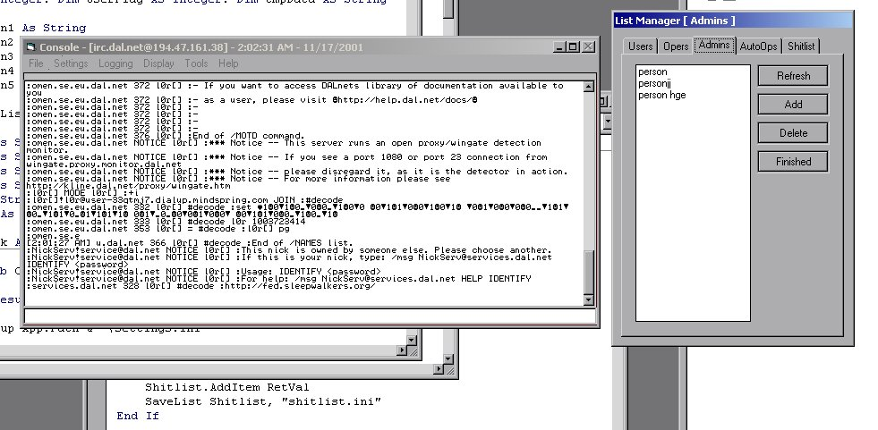



## Advanced IRC Bot A\+

### Description

This code is for advanced vb users, its not verry commented.. it uses alot of functions ive put in small programs in the past. what is deos: it is a dalnet based irc bot for administrating an irc room or having fun. it will convert many things such as: EXAMPLE: %convert asc2bin; hello - it will convert this to binary code, it will also convert hex, chr, asc, and more... this all works in a chat room on irc. the bot will kick, ban and sh&tlist people (kick/ban then when they enter) it supports 3 user levels. user (can use normal functions), operator (can administrate the room and use extended functions), administrator (can add del opers and use all functions), this bot works well, the data arrival sub is quite good, irc parsing is good but will be improved on the next version using raw irc numbers and more globally useable irc information, please take the time to appreciate this code. it is not completely done and i am not satisfied with where it is at this point, however i am never satisfied. i am releasing this little preview of what great things are to come for the reason i need a little user iput to keep going, i have been developing this hard over the past 3 days. i tried to simplify things by splitting things up into functions when nessisary. this could use improvment. please not the ini settings are not FULLY implimented at this point, they will be. read the code over and go on irc with it, check out what it deos. its pretty fun. i used alot of neat tricks in this code so it can be a learning expirence. i format my source quite well so reading it will be easy although it can get intricate. thank you, hope to hear some bad and good comments
 
### More Info
 

             |
---                |---
**Submitted On**   |2001-11-17 01:58:30
**By**             |[l0r](https://github.com/Planet-Source-Code/PSCIndex/blob/master/ByAuthor/l0r.md)
**Level**          |Advanced
**User Rating**    |4.9 (49 globes from 10 users)
**Compatibility**  |VB 6\.0
**Category**       |[Complete Applications](https://github.com/Planet-Source-Code/PSCIndex/blob/master/ByCategory/complete-applications__1-27.md)
**World**          |[Visual Basic](https://github.com/Planet-Source-Code/PSCIndex/blob/master/ByWorld/visual-basic.md)
**Archive File**   |[Advanced\_I3550511162001\.zip](https://github.com/Planet-Source-Code/l0r-advanced-irc-bot-a__1-28944/archive/master.zip)

